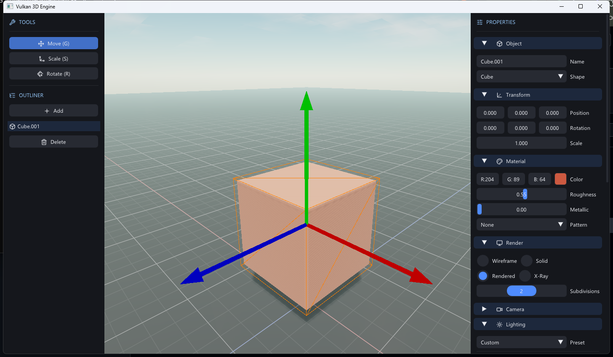

# C Engine

A small Vulkan 3D engine by **Cloudy** — scene editor with physically-based rendering, a real-time atmosphere, and an X-ray view mode. Written in C++ with Dear ImGui, no Vulkan SDK install required.



## Features

**Rendering**
- Cook–Torrance PBR with a metalness workflow — per-object albedo, roughness, metallic
- Directional sun with 2048² shadow map (9-tap Poisson PCF, softness control)
- Physical sky: single-scatter Rayleigh + Mie atmosphere driven by sun direction and turbidity — sunsets redden on their own, sun disk at true angular size
- X-ray render mode: additive surface accumulation like a real radiograph — overlapping objects stack brighter
- Aerial-perspective fog that inherits the horizon sky color, plus sun in-scatter glow
- ACES tonemapping with exposure control; procedural textures (checker, brick, marble, wood)
- Animated FBM clouds lit by atmosphere-filtered sunlight

**Editor**
- Move / Scale / Rotate gizmos: camera-facing billboard arrows, drawn through geometry, nearest-axis picking
- Click selection, outline highlight, undo (Ctrl+Z), duplicate (Shift+D)
- Shapes: cube, sphere, pyramid, cylinder; infinite reference grid with axis lines
- Lighting presets: Daylight, Sunset, Moonlight, Studio, Overcast
- Dear ImGui interface with Lucide icons, modern flat dark theme

## Controls

| Input | Action |
|---|---|
| RMB hold + mouse | Look around |
| WASD / QE (while RMB) | Move camera / down–up |
| Shift (while moving) | Speed boost |
| Scroll wheel | Dolly forward/back |
| LMB | Select object / drag gizmo axis |
| G / S / R | Move / Scale / Rotate tool |
| Shift+D | Duplicate selected |
| Ctrl+Z | Undo |

## Building

Requirements: CMake 3.20+, a C++ compiler, and a Vulkan-capable GPU driver. All dependencies (GLFW, Vulkan-Headers, volk, GLM, Dear ImGui, glslang) are fetched automatically by CMake — no Vulkan SDK needed. Shaders compile to SPIR-V at build time and are embedded into the executable.

```sh
cmake -B build
cmake --build build --config Release
```

Run from anywhere — the icon font is resolved relative to the executable:

```sh
build/Release/glfw_vulkan.exe
```

Optional startup flags: `--bg <0|1|2>` (solid / gradient / atmosphere background), `--rm <0|1|2|3>` (wireframe / solid / rendered / x-ray).

## Tech

C++17 · Vulkan 1.x (via volk) · GLFW · GLM · Dear ImGui · glslang · Lucide icons
